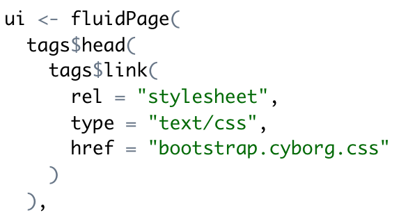

## Bootswatch

Bootswatch hosts a bunch of Bootstrap themes that we can use to change how our app looks

Shiny is not completely compatible with Bootstrap 4 yet, so we need to use Bootstrap 3 themes.

https://bootswatch.com/3/

## Using a new theme

1. Create a www folder in your app directory

    * put any extra files your app references in www (e.g. CSS, images)

2. Choose a theme and download the .css file to www.

    * I prefer the .css over .min.css -- more readable

3. Add `tags$head` and `tags$link` to your UI

## Editing the CSS file

Replace HEX colors

Directly editing the source CSS works, but is tedious and error-prone

## Bootstraplib

A package for styling apps directly from R

Not yet in CRAN

https://rstudio.github.io/bootstraplib/index.html

## Deploying your App

1. Put all the files your app needs in a single directory (the name of the directory will be the name of the app)

2. Make sure there is a file called `app.R` with the call to `shinyApp()`

3. `rsconnect::deployApp("/path/to/app/directory")`

or 

3. The Publish button
